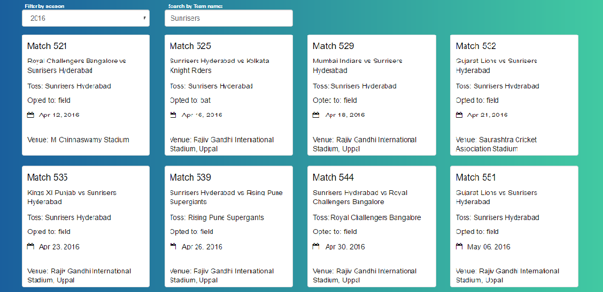

# Ng2-IPL

# Development Details

ng2-ipl is a web application developed as part of "Agile Labs Fullstack Challenge" to list the matches of IPL season, and show complete details of a match.
Built on NodeJS, ExpressJS, MongoDB, and Angular2 (using angular-cli --> http://cli.angular.io)

# Features
1. List all matches in a grid.
2. Search for matches played by a specific teams (of all seasons)
3. Select a match to view complete details
4. Get match summary, ball-by-ball, in detail.

# Deployment Details
1. Install NodeJS, MongoDB on the machine, angular-cli
2. Start MongoDB instance.
3. clone this repository & >"cd" into it
4. run >"npm install" to install all dependencies
5. run >"ng build" to generate final project
6. run >"node server" to start server on >"http://localhost:3000"